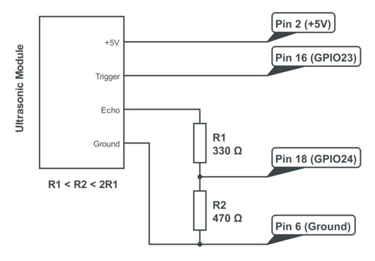

# MQTT-meters
MQTT sensor for water level in tank.

# Requirements

* `Python 2.7`
* `pip install paho-mqtt`
* `pip install RPI-GPIO`

# Hardware

* `Raspberry Pi 3 model B+`
* `Raspberry Pi PoE HAT`
* `5V Ultrasonc Module to measure the water level in a tank`

